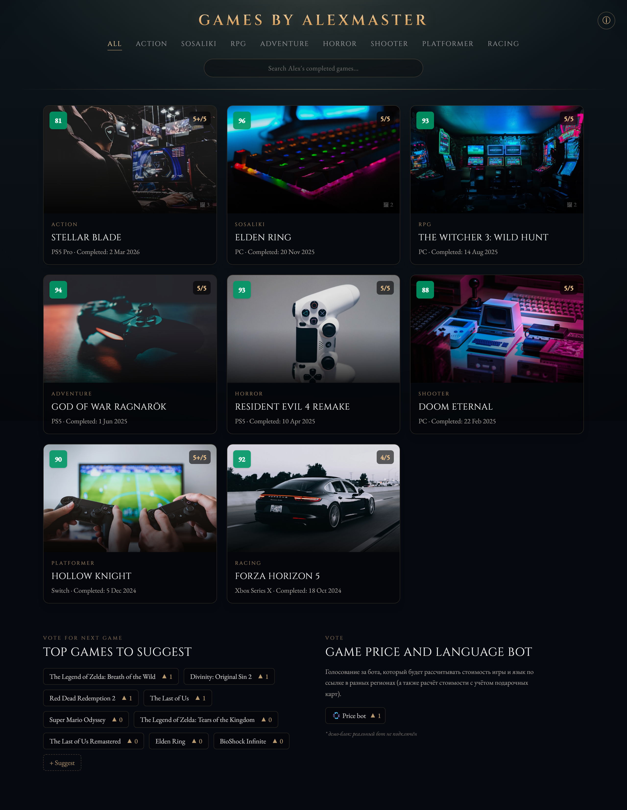
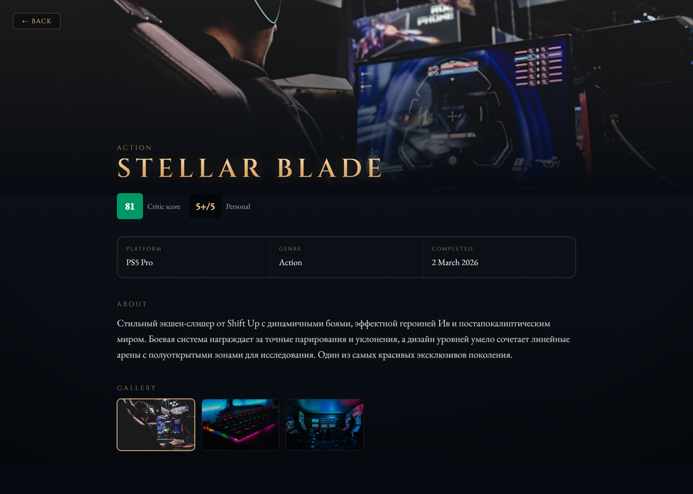
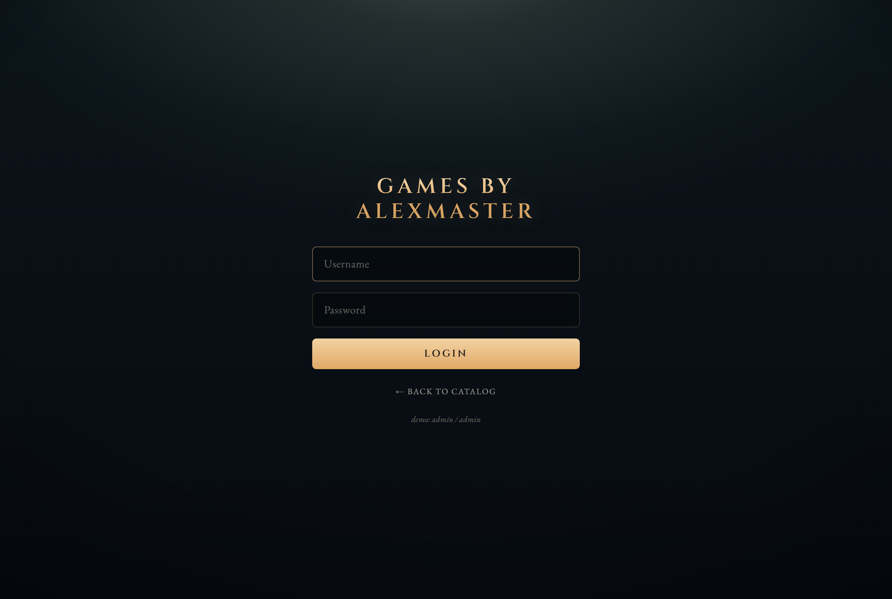
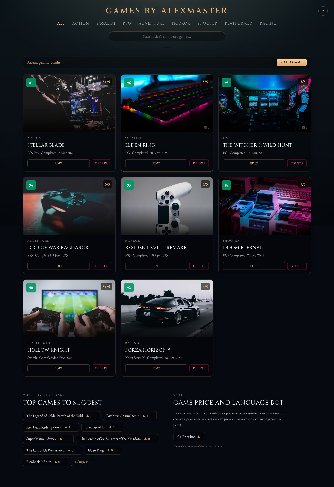
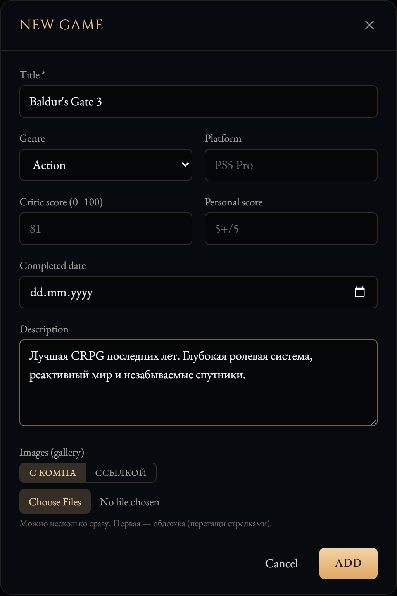

# 📖 Games by AlexMaster — подробное руководство

Кинематографичный full-stack каталог пройденных игр. Это руководство показывает каждый экран и объясняет, как всем пользоваться — с картинками.

---

## 🚀 Быстрый старт (одна команда)

Нужен только [Bun](https://bun.sh) (`irm bun.sh/install.ps1 | iex` на Windows).

```powershell
# 1. Первичная настройка: ставит зависимости + создаёт и заполняет БД
bun run setup

# 2. Запуск ВСЕГО проекта (бэк + фронт) одной командой
bun run dev
```

После `bun run dev` поднимутся оба сервиса:

| Сервис   | Адрес                 | Что это                        |
| -------- | --------------------- | ------------------------------ |
| Frontend | http://localhost:5173 | Сайт (открывай этот)           |
| Backend  | http://localhost:3001 | API на Elysia (проксируется)   |

Логи бэка и фронта идут в один терминал с цветными метками `backend` / `frontend`. Останавливается всё разом по `Ctrl + C`.

> Первый запуск без настройки: `bun run setup && bun run dev`.

---

## 🖥️ Экраны

### 1. Каталог (главная)



Публичная витрина — видна всем без входа.

- **Шапка** «GAMES BY ALEXMASTER» — клик возвращает к полному списку (сбрасывает фильтр).
- **Навигация по жанрам**: `All · Action · Sosaliki · RPG · Adventure · Horror · Shooter · Platformer · Racing`. Клик фильтрует каталог по жанру.
- **Поиск** «Search Alex's completed games...» — фильтрует по названию на лету (с задержкой 300 мс).
- **Карточки игр** в стиле лаунчера:
  - оценка критиков (0–100) — цветной бейдж слева сверху (зелёный ≥80, жёлтый ≥60, красный ниже);
  - личная оценка (`5+/5`) — справа сверху;
  - счётчик `🖼 N` — сколько картинок в галерее;
  - жанр, название, платформа и дата прохождения.
- Клик по карточке → **страница игры**.
- **Внизу** — блок голосования «Top games to suggest» и блок-заглушка «Game price and language bot».

---

### 2. Страница игры



Открывается по клику на карточку, имеет собственный URL `/game/:id`.

- **Большая обложка-герой** с затемнением и кнопкой `← Back`.
- **Заголовок, жанр, оценки** (критики + личная).
- **Блок деталей**: платформа, жанр, дата прохождения.
- **About** — развёрнутое описание/обзор игры.
- **Gallery** — все картинки игры миниатюрами; клик по миниатюре меняет большое фото-герой.
- Для авторизованного админа здесь же кнопки **Edit / Delete**.

---

### 3. Вход (логин)



- Открывается по иконке **ⓘ** справа вверху, либо по адресу `/login`.
- Демо-доступ: **admin / admin**.
- После входа возвращаешься в каталог уже в режиме админа.
- Авторизация настоящая: пароль хранится хешем (`Bun.password`), вход выдаёт JWT, который кладётся в `localStorage` и шлётся с защищёнными запросами.

> Сменить логин/пароль: переменные `ADMIN_USERNAME` / `ADMIN_PASSWORD` перед `bun run db:seed`. Для прода обязательно задать свой `JWT_SECRET`.

---

### 4. Админ-режим



После входа появляется:

- **Плашка «Админ-режим · admin»** с кнопкой **+ Add game**.
- На каждой карточке — кнопки **Edit / Delete** (клик по ним не открывает страницу игры).
- В блоке голосования можно удалять кандидатов.
- Иконка справа вверху меняется на **⎋** (выход).

Гость (без входа) всё это не видит — только смотрит каталог и голосует.

---

### 5. Форма игры (добавление / редактирование)



Открывается по **+ Add game** или **Edit**.

Поля:

| Поле             | Описание                                            |
| ---------------- | --------------------------------------------------- |
| **Title**        | Название (обязательно)                              |
| **Genre**        | Жанр из списка                                      |
| **Platform**     | Платформа (PS5 Pro, PC, Switch…)                    |
| **Critic score** | Оценка критиков 0–100                               |
| **Personal**     | Личная оценка в свободной форме (`5+/5`)            |
| **Completed**    | Дата прохождения                                    |
| **Description**  | Развёрнутое описание / обзор                        |
| **Images**       | Галерея картинок (см. ниже)                         |

#### Загрузка картинок — на выбор

Переключатель **«С компа / Ссылкой»**:

- **С компа** — кнопка выбора файлов. Можно выбрать **сразу несколько**; они загрузятся на бэк (в `backend/uploads/`) и добавятся в галерею. Допускаются `jpg / png / webp / gif`, до 8 МБ, до 10 за раз.
- **Ссылкой** — вставляешь URL картинки и жмёшь `+`.

Можно **смешивать оба способа** в одной галерее. У каждой картинки превью; её можно **удалить** или **переставить** стрелками. **Первая картинка — обложка** (помечена `cover`).

---

## 🗂️ Структура проекта

```
Game Tracker/
├── package.json              # ← корневые команды: setup / dev (concurrently)
├── README.md                 # этот файл — руководство со скриншотами
├── docs/images/              # скриншоты для документации
├── backend/                  # Elysia + Drizzle + SQLite
│   ├── src/
│   │   ├── index.ts
│   │   ├── db/{schema,index,migrate,seed}.ts
│   │   └── routes/{auth,games,suggestions,upload}.ts
│   ├── drizzle/              # SQL-миграции
│   ├── uploads/              # загруженные картинки (gitignored)
│   └── local.db              # файл БД
└── frontend/                 # React + Vite + TS + Tailwind
    └── src/
        ├── App.tsx           # роуты
        ├── pages/{CatalogPage,GamePage,LoginPage}.tsx
        ├── components/{Navbar,GameCard,GameFormModal,ImageManager,VoteSuggestions,PriceBot,Login,Modal}.tsx
        └── lib/{api.ts,auth.tsx}
```

---

## 🔧 Полезные команды

Из корня проекта:

| Команда            | Что делает                                           |
| ------------------ | ---------------------------------------------------- |
| `bun run setup`    | Установить зависимости + создать и заполнить БД      |
| `bun run dev`      | Запустить бэк и фронт вместе (Ctrl+C — остановить)   |
| `bun run db:reset` | Пересоздать и заново заполнить БД                    |

Точечно (из папки `backend`):

| Команда             | Что делает                          |
| ------------------- | ----------------------------------- |
| `bun run db:seed`   | Заново залить демо-данные           |
| `bun run db:studio` | Открыть Drizzle Studio (просмотр БД)|

---

## ⚠️ Что честно НЕ так, как в оригинальном видео

- **Это не побайтовая копия** проекта RED Group — исходников нет, код с экрана не считывался. Это самостоятельный рабочий аналог на том же стеке (React + Elysia + Drizzle + SQLite) с тем же дизайном и UX.
- **Фон** — атмосферный CSS-градиент, а не конкретный игровой скрин из видео. Меняется через `--bg-image` / `.app-bg` в [frontend/src/index.css](frontend/src/index.css).
- **Бот цен** («Game price and language bot») — визуальная заглушка, реального Telegram-бота нет.
- **Демо-обложки** — ссылки на Unsplash (нужен интернет). Свои картинки добавляются через форму.
- **Загрузка файлов** — в локальную папку `backend/uploads/`. Для прода обычно выносят в облако (S3 и т.п.).
- **Порт бэка** — `3001` (3000 был занят другим сервисом). Меняется через `PORT`.
- **SPA на проде**: при деплое статики нужен fallback всех путей на `index.html`, иначе прямой заход на `/game/1` даст 404. В dev (Vite) уже работает.
